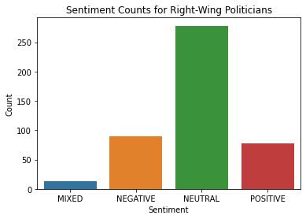

# Protests and Points of View: The Recent Case of Colombia

## Introduction

Since the start of May Colombia has experienced massive protests, mostly due to the social unrest that Covid-19 left in the country -- particularly in terms of poverty and unemployment. These protests have gained traction with young people and those upset (about anything and everything) with the government. It is not uncommon that these days there are massive congregations of people in the largest cities, demanding to be heard by the government and getting more vocal as time goes on. 

Sadly, these protestors have been continuously met with apathy by the government and with stark police repression -- police violence often. The government flat out rejected to meet with the protestors and labels then as vandals or antisocials, consistently using police force to dissipate people from meeting areas and limiting their ability to demonstrate.  

As a result of this dynamic, different views began to emerge on what the protests meant. The people agreeing with the protests see them as justifiable -- necessary even, considering the historical demands that have accumulated over time and have yet to be solved by most governments. On the other hand, those who view the protestors as vandals tend to see the actions taken by the protestors as violent and think that they must be stopped at any cost – looking back on the demands that old leftist guerrillas made and associating demonstrators with them. 

After weeks of intense protests and with mounting pressure from the international community the government agreed to meet to discuss ending the protests. Unfortunately, these meetings never arrive at any result, furthermore, they became a showcase of the difference in opinions of both parties involved. 

Considering this, the goal of this project is to study how different actors see the ongoing protests, not only to understand the differences in points of view but to see if there is common ground in order to move forward and overcome these difficult times.  In order to do so, I will study the tweets of key representatives among the political spectrum in Colombia, adding journalists and institutions (police, general attorney, etc.) to see how the perceive the protests.  


## Code 


```python
from dask.distributed import Client
from dask import delayed
import dask.dataframe as dd
import pandas as pd
import nest_asyncio
import pywren
import boto3
import twint
import dask

nest_asyncio.apply()

client = Client()
client
```

    /home/javier/macs30123/lib/python3.7/site-packages/distributed/node.py:164: UserWarning: Port 8787 is already in use.
    Perhaps you already have a cluster running?
    Hosting the HTTP server on port 37345 instead
      expected, actual


<table style="border: 2px solid white;">
<tr>
<td style="vertical-align: top; border: 0px solid white">
<h3 style="text-align: left;">Client</h3>
<ul style="text-align: left; list-style: none; margin: 0; padding: 0;">
  <li><b>Scheduler: </b>tcp://127.0.0.1:46839</li>
  <li><b>Dashboard: </b><a href='http://127.0.0.1:37345/status' target='_blank'>http://127.0.0.1:37345/status</a></li>
</ul>
</td>
<td style="vertical-align: top; border: 0px solid white">
<h3 style="text-align: left;">Cluster</h3>
<ul style="text-align: left; list-style:none; margin: 0; padding: 0;">
  <li><b>Workers: </b>4</li>
  <li><b>Cores: </b>8</li>
  <li><b>Memory: </b>13.64 GiB</li>
</ul>
</td>
</tr>
</table>


### Getting Tweets

My process uses AWS translate and comprehend, in order to assess tweet information. This decision is important and stems from the fact that AWS translate can recognize the original language of the tweet and translate it into a specific language without issues. This is useful because after the police violence facts became known worldwide, several institutions and politicians began tweeting other languages to reach a broader audience. 


```python
### AWS Functions

def get_translation(text):
    trans = boto3.client('translate').translate_text(Text = text, 
                                      SourceLanguageCode='auto',
                                      TargetLanguageCode='en')
    return trans['TranslatedText']

def get_sentiment(text):
    comprehend = boto3.client('comprehend')
    sent = comprehend.detect_sentiment(Text = text, 
                              LanguageCode='en')
    return sent['Sentiment']
```

The selected accounts are key politicians from the political spectrum, including the most vocal sides of their parties and the most influential. The journalists were also selected based on this criterion whereas the institutions were selected to monitor the official response of the government. The selection of Twint as a twitter scraper is related to the easiness it provides to get tweets since a particular date -- Tweepy limits the requests of this nature that can be done using Twitters API.  

It must be noted that the translation and sentiment analysis is done for each tweet history using pywren, which uses more lambda instances whenever a particular tweet history becomes larger e.g., the police makes around 500 tweets a week, compared to 50 of some politicians. Using this process, key information was added to the dataset in around 5 minutes -- for something that took around 3 hours when done serially. 

Finally, onece the data was processed, it is saved in json files so that it can be shared with anyone interested and help them avoid this step.


```python
# Accounts of Interest

accounts = {"institution" : ["PoliciaColombia", "mindefensa", "PGN_COL", 
                              "CancilleriaCol", "FiscaliaCol"],
            "right" : ["AlvaroUribeVel", "MariaFdaCabal", "IvanDuque", 
                            "PalomaValenciaL", "mluciaramirez"],
            "center" : ["DeLaCalleHum", "AngelicaLozanoC", "JuanitaGoe", 
                        "sergio_fajardo", "EnriquePenalosa"],
            "left" : ["petrogustavo", "AidaAvellaE", "angelamrobledo", 
                           "GustavoBolivar", "TimoComunes"],
            "journalist" : ["MJDuzan", "fdbedout", "VickyDavilaH", 
                            "CeciliaOrozcoT", "DCoronell"]}

# Functions

def scrape_user(username):

    c = twint.Config()
    c.Username = username
    c.Lang = 'es'
    c.Since = '2021-05-28'
    c.Hide_output = True
    c.Pandas = True

    twint.run.Search(c)
 
    return list(twint.storage.panda.Tweets_df.to_dict('index').values())

def translate_and_get_sentiment(list_text):

    text = list_text["tweet"]
    list_text["text_translated"] = get_translation(text)
    list_text["sentim"] = get_sentiment(list_text["text_translated"])

    return list_text
    

def scrape_list(user_list, user_type):
    pwex = pywren.default_executor()
    for user in user_list:
        tweet_dict = scrape_user(user)        
        futures = pwex.map(translate_and_get_sentiment, tweet_dict)
        tweet_final = pywren.get_all_results(futures)
        
        pd.DataFrame(tweet_final). \
        to_json("/home/javier/macs30123/project/tweet_histories/{}/tweets_{}.json". \
        format(user_type, user, orient="index"))
    
for user_class, user_list in accounts.items():
    scrape_list(user_list, user_class)    
```

### Analyzing the Data

The data is loaded from the json files in separated Dask dataframes in order to ease separate analysis -- a necessity given the differences in tweet volume. 


```python
right_df = dd.read_json('tweet_histories/right/*.json', lines=False)
left_df = dd.read_json('tweet_histories/left/*.json', lines=False)
center_df = dd.read_json('tweet_histories/center/*.json', lines=False)
institution_df = dd.read_json('tweet_histories/institution/*.json', lines=False)
journalist_df = dd.read_json('tweet_histories/journalist/*.json', lines=False)
institution_df.head()
```


<div>
<style scoped>
    .dataframe tbody tr th:only-of-type {
        vertical-align: middle;
    }

    .dataframe tbody tr th {
        vertical-align: top;
    }

    .dataframe thead th {
        text-align: right;
    }
</style>
<table border="1" class="dataframe">
  <thead>
    <tr style="text-align: right;">
      <th></th>
      <th>id</th>
      <th>conversation_id</th>
      <th>created_at</th>
      <th>date</th>
      <th>timezone</th>
      <th>place</th>
      <th>tweet</th>
      <th>language</th>
      <th>hashtags</th>
      <th>cashtags</th>
      <th>...</th>
      <th>user_rt_id</th>
      <th>user_rt</th>
      <th>retweet_id</th>
      <th>reply_to</th>
      <th>retweet_date</th>
      <th>translate</th>
      <th>trans_src</th>
      <th>trans_dest</th>
      <th>text_translated</th>
      <th>sentim</th>
    </tr>
  </thead>
  <tbody>
    <tr>
      <th>0</th>
      <td>1402430245379010560</td>
      <td>1402430245379010560</td>
      <td>2021-06-09 01:00:01</td>
      <td>2021-06-08 20:00:01</td>
      <td>-500</td>
      <td></td>
      <td>.@ComunidadAndina es una organización int. que...</td>
      <td>es</td>
      <td>[]</td>
      <td>[]</td>
      <td>...</td>
      <td></td>
      <td></td>
      <td></td>
      <td>[]</td>
      <td></td>
      <td></td>
      <td></td>
      <td></td>
      <td>. @ComunidadAndina is an int. organization ope...</td>
      <td>NEUTRAL</td>
    </tr>
    <tr>
      <th>1</th>
      <td>1402406684975407104</td>
      <td>1402406684975407104</td>
      <td>2021-06-08 23:26:23</td>
      <td>2021-06-08 18:26:23</td>
      <td>-500</td>
      <td></td>
      <td>“No habrá tolerancia con nadie que viole los D...</td>
      <td>es</td>
      <td>[]</td>
      <td>[]</td>
      <td>...</td>
      <td></td>
      <td></td>
      <td></td>
      <td>[]</td>
      <td></td>
      <td></td>
      <td></td>
      <td></td>
      <td>“There will be no tolerance with anyone who vi...</td>
      <td>NEUTRAL</td>
    </tr>
    <tr>
      <th>2</th>
      <td>1402384947994836992</td>
      <td>1402384947994836992</td>
      <td>2021-06-08 22:00:01</td>
      <td>2021-06-08 17:00:01</td>
      <td>-500</td>
      <td></td>
      <td>Embajador de Colombia en Chile presentó cartas...</td>
      <td>es</td>
      <td>[]</td>
      <td>[]</td>
      <td>...</td>
      <td></td>
      <td></td>
      <td></td>
      <td>[]</td>
      <td></td>
      <td></td>
      <td></td>
      <td></td>
      <td>Colombian Ambassador to Chile presented creden...</td>
      <td>NEUTRAL</td>
    </tr>
    <tr>
      <th>3</th>
      <td>1402367418375229440</td>
      <td>1402367408053096448</td>
      <td>2021-06-08 20:50:21</td>
      <td>2021-06-08 15:50:21</td>
      <td>-500</td>
      <td></td>
      <td>Estamos dedicados a construir un futuro de esp...</td>
      <td>es</td>
      <td>[]</td>
      <td>[]</td>
      <td>...</td>
      <td></td>
      <td></td>
      <td></td>
      <td>[]</td>
      <td></td>
      <td></td>
      <td></td>
      <td></td>
      <td>We are dedicated to building a future of hope,...</td>
      <td>POSITIVE</td>
    </tr>
    <tr>
      <th>4</th>
      <td>1402367417255333888</td>
      <td>1402367408053096448</td>
      <td>2021-06-08 20:50:21</td>
      <td>2021-06-08 15:50:21</td>
      <td>-500</td>
      <td></td>
      <td>Los jóvenes seguirán siendo el motivo de nuest...</td>
      <td>es</td>
      <td>[vicepresidenteycanciller]</td>
      <td>[]</td>
      <td>...</td>
      <td></td>
      <td></td>
      <td></td>
      <td>[]</td>
      <td></td>
      <td></td>
      <td></td>
      <td></td>
      <td>Young people will continue to be the reason fo...</td>
      <td>POSITIVE</td>
    </tr>
  </tbody>
</table>
<p>5 rows × 40 columns</p>
</div>


### Creating Wordclouds


```python
from wordcloud import WordCloud, STOPWORDS
import matplotlib.pyplot as plt
import seaborn as sns 

comment_words = ''
stopwords = set(STOPWORDS)
stopwords.add("https")
```


```python
def plot_word_cloud(trans_tweets, comment_words, stopwords): # https://bit.ly/3zdr5FD

    for row in trans_tweets:
        val = str(row)
        tokens = val.split()
        for i in range(len(tokens)):
            tokens[i] = tokens[i].lower()
        comment_words += " ".join(tokens)+" "

    wordcloud = WordCloud(width = 800, height = 800,
                    background_color ='white',
                    stopwords = stopwords,
                    min_font_size = 10).generate(comment_words)

    plt.figure(figsize = (8, 8), facecolor = None)
    plt.imshow(wordcloud)
    plt.axis("off")
    plt.tight_layout(pad = 0)
    plt.show()
```

## Results

#### Journalists

The tweets made by journalists remained somewhat neutral with similar proportions of negative and positive sentiments. Interestingly, their tweets showcase the spaces where they share their opinions and are centered around next year's elections and the events in Cali -- the city with the heaviest protests and repression. However, there is not a cohesive theme among those tweets. 


```python
sentim_journal = journalist_df[["sentim", "id"]].groupby("sentim").count().reset_index().compute()
jour_bar = sns.barplot(x = "sentim", y = "id", data = sentim_journal)
jour_bar.set(xlabel="Sentiment", ylabel='Count', title='Sentiment Counts for Journalists')
jour_bar
```


    <AxesSubplot:title={'center':'Sentiment counts for journalists'}, xlabel='Sentiment', ylabel='Count'>


    

    


```python
plot_word_cloud(journalist_df["text_translated"], comment_words, stopwords)
```


    

    


#### Institutions

Just like journalist, institutions keep their message neutral but unlike them, their word cloud has a clear topic i.e., the prosecution and law enforcement actions that protestors will face. The word cloud is filled with tokens related to security and the action of the national institutions. 


```python
sentim_inst = institution_df[["sentim", "id"]].groupby("sentim").count().reset_index().compute()
inst_bar = sns.barplot(x = "sentim", y = "id", data = sentim_inst)
inst_bar.set(xlabel="Sentiment", ylabel='Count', title='Sentiment Counts for Institutions')
inst_bar
```


    <AxesSubplot:title={'center':'Sentiment Counts for Institutions'}, xlabel='Sentiment', ylabel='Count'>


    

    


```python
plot_word_cloud(institution_df["text_translated"], comment_words, stopwords)
```


    

    


### Right-Wing Politicians

Right wing politicians have also a tweet history dominated by neutral tweets yet their word cloud shows that the view the protests as something linked to violence, as a risk to democracy. Moreover, I believe the cloud also shows how they support the police actions and their strengthening 


```python
sentim_right = right_df[["sentim", "id"]].groupby("sentim").count().reset_index().compute()
right_bar = sns.barplot(x = "sentim", y = "id", data = sentim_right)
right_bar.set(xlabel="Sentiment", ylabel='Count', title='Sentiment Counts for Right-Wing Politicians')
right_bar
```


    <AxesSubplot:title={'center':'Sentiment Counts for Right-Wing Politicians'}, xlabel='Sentiment', ylabel='Count'>


    

    


```python
plot_word_cloud(right_df["text_translated"], comment_words, stopwords)
```


    

    


### Left-Wing Politicians

Contrary to what was seen above, left-wing politicians have a tweet history with more negative emotions -- which makes sense due to the dire situation of the country. It can be seen that their word cloud is defined by words that characterize the protests as something carried out by young (peaceful) people and that deem the police response as excessive. Interestingly, there is little to no overlap with the right-wing cloud. 


```python
sentim_left = left_df[["sentim", "id"]].groupby("sentim").count().reset_index().compute()
left_bar = sns.barplot(x = "sentim", y = "id", data = sentim_left)
left_bar.set(xlabel="Sentiment", ylabel='Count', title='Sentiment Counts for Left-Wing Politicians')
left_bar
```


    <AxesSubplot:title={'center':'Sentiment Counts for Left-Wing Politicians'}, xlabel='Sentiment', ylabel='Count'>


    

    


```python
plot_word_cloud(left_df["text_translated"], comment_words, stopwords)
```


    

    


#### Center Politicians

Finally, center-oriented politicians have a slightly more negative inclined twitter feed, nonetheless it remains mostly neutral. The word cloud shows that their interest is on the debate and the need for reform. Here young people are also mentioned often. Interestingly, this cloud shares more with the left-wing word cloud but is dominated by different topics. 


```python
sentim_center = center_df[["sentim", "id"]].groupby("sentim").count().reset_index().compute()
center_bar = sns.barplot(x = "sentim", y = "id", data = sentim_center)
center_bar.set(xlabel="Sentiment", ylabel='Count', title='Sentiment Counts for Center Politicians')
center_bar
```


    <AxesSubplot:title={'center':'Sentiment Counts for Center Politicians'}, xlabel='Sentiment', ylabel='Count'>


    

    


```python
plot_word_cloud(center_df["text_translated"], comment_words, stopwords)
```


    

    


## Conclusions

After this exercise, there is little doubt that Colombia is strongly polarized as key representatives of the Left-wing and the Right-wing have little to no overlap in the words they use to characterize the protests nor in the sentiment they express when writing their tweets. These results in turn showcase the little space that there is for one side to end approach the other -- narratives seem to be just too far apart.  

It is interesting that the center-leaning politicians focus their efforts on trying to give dialogue a major role and even more interesting that words associated with such dialogue have little to no space in the other word clouds.  

It is thus necessary to have a closer look at the protests and focus efforts on stopping police violence and guaranteeing the protestors rights – key role of the international community. These results should be made public to bring further awareness on the divides of the country and propose a path forward.  -- after a broader set of politicians ins included, which should be easy given the scalability of the code.
